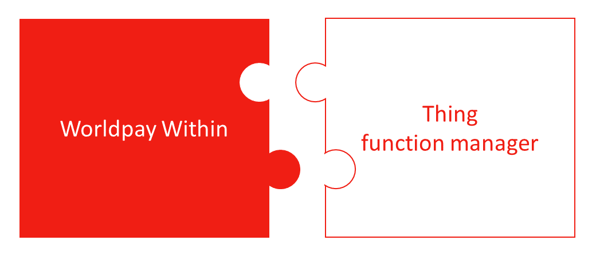
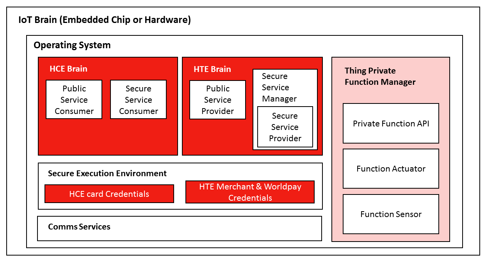
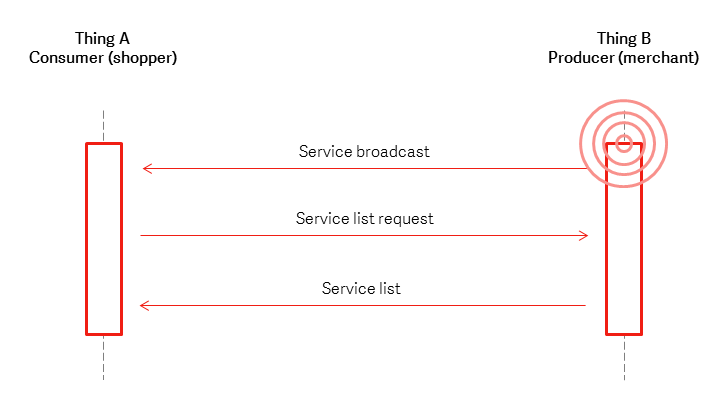
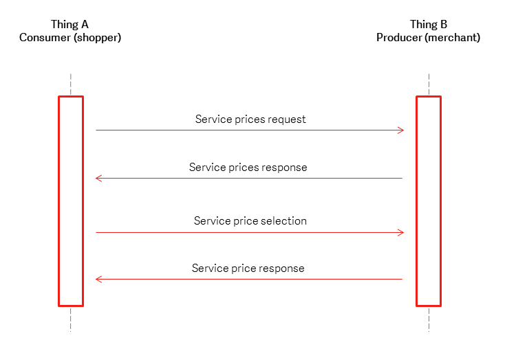
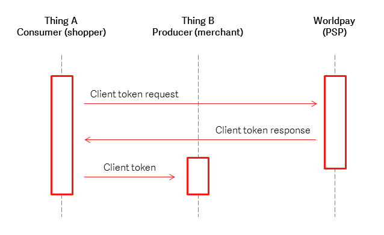
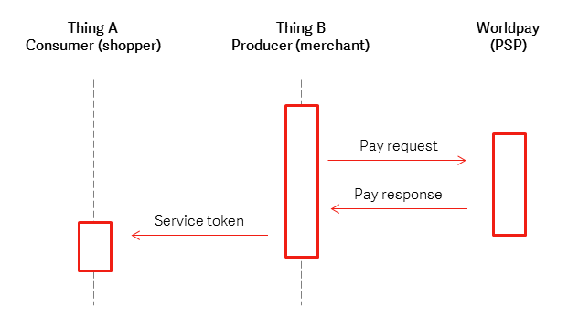
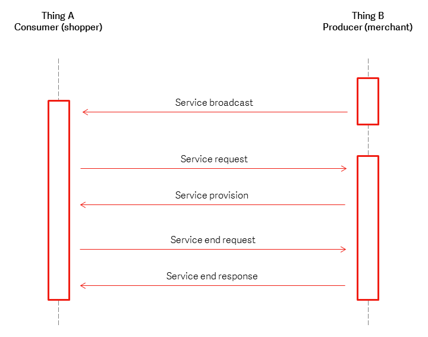

To complement the architecture we've released the Worldpay Within SDK. The intention for the SDK is to encapsulate implementation and help third party vendors and developers integrate into their Internet of Things (IoT) solutions.

The core of the SDK is developed in the Go programming language with wrappers created for [Java](java), [Node.js](nodejs), [Python](python27) and [.NET](dotnet). Service delivery and broadcast have been implemented using TCP/IP networking.

For more information about the low level service messaging, click [here](sample-service-messaging).

## Architecture Overview

In the IoT, each Thing will perform the function it is designed for, be it acting as a sensor, a controller or both. In order for the Thing to be able to make and receive payments for services they can provide to other Things, they need to add the payments functionality contained in Worldpay Within.

<figcaption>Figure 1\. Worldpay Within Pluggable agent.</figcaption>

Things in the IoT will be implemented on dedicated low cost processor systems. The Thing and Worldpay Within must co-exist and operate on the resources provided by these devices, as demonstrated in Figure 2.

<figcaption>Figure 2\. Worldpay Within Logical Overview.</figcaption>

In order to make and receive payments in the IoT, a Thing must be able to perform the roles of consumer (shopper), to make a payment for services, and the producer (merchant), to receive a payment for provision of services. In the Worldpay Within IoT architecture, the “consumer” pays for services by supporting Host Card Emulation (HCE). The “merchant” or "producer" receives payments for services by supporting Host Terminal Emulation (HTE). Worldpay Within contains both HCE Brain and HTE Brain functionalities, ensuring a Thing can both consume and supply services. These services are provided through a series of public APIs, described within this document.

During the payments process, HCE and HTE require the secure storage and use of credentials. This requires the use of secure processing within the Thing in a “Secure Execution Environment”. For HCE Things, these credentials include the details of the “card” which the payment will be made from. For HTE Things, these credentials include the details the Merchant requires to perform transactions with Worldpay.

As well as the provision of the payment for the services, Worldpay Within provides for the generation and validation of secure service tokens, which allow for services to be consumed in part or together, but separately from the payments functionality.

## Worldpay Within IoT Service Architecture

The provision of a service within the Worldpay IoT system is performed in 4 phases, as shown in Figure 3. These are:  **Discover**, **Select**, **Pay**, and **Release**. Each of these phases are described in the following sections.

<figcaption>Figure 3\. The 4 phases of Worldpay Within.</figcaption>

## Discover

For each Thing that offers services, the service ‘producer’ shall broadcast its list of available services, as shown in Figure 4 below. When a potential ‘consumer’ of the service connects with ‘producer’, it can request details of the services offered.

Providing a suitable service is discovered, the consumer then requests the service from the producer, and price negotiations can begin.

<figcaption>Figure 4\. IoT Service discovery.</figcaption>

### Service Discovery APIs

|**Key**|**Parameters**|**Purpose**|
| ------------- | ------------- | ----- |
|broadcast|`server_UUID`|Advertising services and identifying the sender.|
|request services|none|Request a list of all services.|
|services_response|`list of services`, `server_UUID`|Provide client with a list of possible services that the sender can provide.|

### Service discovery messages

A broadcast message that includes **Thing B**’s UUID is sent.

Upon receiving the message, **Thing A** connects to **Thing B** and requests the list of available services.

**Thing B** responds with a list identifying the services available.

## Select

Once a suitable service has been discovered, the shopper will make the choice. The provider may offer the same service at different rates depending on the number of units of service to be purchased. The process is outlined in Figure 5\. The outcome of the process is an agreement to purchase an amount of service and a total price for the service to be provided. The service provider can then request payment for the agreed service and price.

<figcaption>Figure 5\. IoT Service Negotiation.</figcaption>

### Service selection APIs

|**Key**|**Parameters**|**Purpose**|
| ------------- | ------------- | ----- |
|`price_request`|`service_id`|Request a list of all prices for a given service.|
|`price_response`|`server_UUID`, list of prices, (`service_id`, `price_id`, `price_per_unit`, `unit_ID`, `unit_description`, `price_description`)|Provide the client with a list of prices for a given service. A price object contains the per unit price.|
|`price_select`|`service_id`, `price_id`, `number_of_units`, `client_UUID`|Select a price with `price_id`, for `service_id` for a number of units.|
|`price_select_response`|`price_id`, `number_of_units`, `total_price`, `server_UUID`, `client_UUID`, `payment_ref_ID`, `Merchant_Client_key`|Communicate the expected total price to the client.|

### Service selection messages

A price request is sent containing the selected `service_id`.

The response from **Thing B** contains a list of price items; each item should contain a `price_id`, per unit price, `unit_ID` and `description` fields of both the unit and the price.

**Thing A** then selects an appropriate `price_id` by sending a request with its `client_UUID`, the selected `service_id`, the `price_id`, and the number of items required.

If the number of items falls within the correct number of items for the price selected, then **Thing B** responds with a price select response containing the `service_id`, `price_id`, the total price, the `service_UUID` and a reference for the payment and its Merchant Client key. Otherwise, **Thing B** shall return the number of units it can supply along with the correct price, and additional details required to initiate the payment.

## Pay

The payment process with Worldpay is a two stage process, split between the consumer and merchant Things involved in the transaction:

1.  Client Token Request
2.  Payment Authorisation Request (Also known as Order Request)

During the first stage, the consumer sends Worldpay their payment credentials and the merchants Client Key. We return a Client Token, which the consumer passes to the Merchant. This allows the merchant to perform the payment authorisation request with Worldpay by providing the Client Token and transaction details.

This payment process ensures that the consumer does not pass their payment credentials to the merchant, only to Worldpay.

### Client token request

The first step in the payment process is when **Thing A** receives the `Merchant_Client_Key` from **Thing B**. **Thing B** passes their public Client Key to **Thing A** as part of the `price_select_response` during the Service Negotiation phase. Upon receiving the Client Key from **Thing B**, **Thing A** connects with Worldpay to request the client token from us. This request includes **Thing A**’s payment credentials: Card PAN, expiry, and the `client_key` of **Thing B**. Worldpay will respond with a message that includes a `client_token`. This is shown in Figure 6.

<figcaption>Figure 6\. IoT Payment process - client token request.</figcaption>

#### Client token request APIs

##### Thing A to Worldpay client token request

|**Key**|**Parameters**|**Purpose**|
| ------------- | ------------- | ----- |
|`client_token_request`|`Payment_method`, `reusable_flag`, `Merchant_client_key`, `Payment_method` (`name`, `PAN`, `expiryMonth`, `expiryYear`, `type`)|Request a client token from Worldpay, whilst providing us with the payment credentials.|
|`client_token_response`|`client_token`, `reusable_flag`, `payment_method_response` (`type`, `name`, `expiryMonth`, `expiryYear`, `card_type`, `card_scheme\_type`, `card_scheme_name`, `masked_card_number`, `card_product_type_description_non_contactless`, `card_product_type_description_contactless`, `card_issuer`, `country_code`, `card_class`, `pre-paid`)|Response from Worldpay containing the client_token.|
|`Payment_request`|`client_token`, `client_UUID`, `payment_ref_ID`|The `client_token` is passed to Thing B to allow the 2^nd^ part of the transaction process to take place.|

**Thing A** will connect to Worldpay using Transport Layer Security (TLS). It will then request a `client_token` by securely (see 2.2.1) sending a JSON message containing the `paymentMethod`, its payment credentials (PAN, expiry) to us, along with the `client_key` from **Thing B**. In addition, a flag indicating if the client details can be used in future is sent. For IoT this should always be set `‘reusable’:’false’` in order to force the generation of a new client token for each transaction.

A successful response will be an HTTP `POST` response containing fields: `client_token`, `reusable_flag` and the `payment_method_response`. Once received, the `client_token` is passed to **Thing B**.

A sample request is shown in [Sample Service Messaging](sample-service-messaging).

See [API keys](https://developer.worldpay.com/jsonapi/docs/api-keys) for documentation on `client_token_request` and `client_token_repsonse` APIs data descriptions.

#### Payment authorisation request

**Thing B** will process the order and request the payment from Worldpay providing its service key, `client_token`, transaction currency and payment amount. This is transmitted to Worldpay over TLS. After successfully processing the payment, Worldpay will provide a payment response. **Thing B** shall then generate a service token, which **Thing A** may use in future to obtain the services that the payment has been made for. This is shown in Figure 7.

<figcaption>Figure 7\. Payment Authorisation Request.</figcaption>

#### Payment authorisation request APIs

##### Thing B to Worldpay payment authorisation request

|**Key**|**Parameters**|**Purpose**|
| ------------- | ------------- | ----- |
|`order_request`|`client_service_key`, `client_token`, `currency_code`, `amount`, `order_description`, `customer_order_code`|Request payment from Worldpay.|
|`order_response`|`order_code`, `client_token`, `order_description`, `amount`, `currency_code`, `payment_status`, `customer_order_code`, `environment`, `risk_score`, `payment_response` (`type`, `name`, `expiryMonth`, `expiryYear`, `card_type`, `card_scheme_type`, `card_scheme_name`, `masked_card_number`, `card_product_type_description_non_contactless`, `card_product_type_description_contactless`, `card_issuer`, `country_code`, `card_class`, `pre-paid`)|Payment response indicating a successful transaction on the Worldpay platform.|

**Thing B** will assemble a message to be posted to Worldpay that contains the client token, Service key, the amount, currency and transaction description. We will then perform an authorisation using the payment credentials identified by the `client_token`. A successful authorisation will result in a `payment_status` of SUCCESS being returned to **Thing B**.

##### Thing B to Thing A service token

|**Key**|**Parameters**|**Purpose**|
| ------------- | ------------- | ----- |
|`payment_request_response`|`service_delivery_token`, `server_UUID`, `client_UUID`, `total_paid`|`service_delivery_token` is passed to Thing B.|

**Thing B** shall then generate a cryptographically secure `service_delivery_token`, which can be used by **Thing A** to request provision of services from **Thing B**.

## Delivery

Once the payment has been made, **Thing B** shall return to broadcasting its available services. **Thing A** will now be able to consume the service from **Thing B** by providing the `service_delivery_token`. The service delivery may be in a single step, or over time. An overview of service delivery is shown in Figure 8.

<figcaption>Figure 8\. Service delivery.</figcaption>

Once in possession of a `service_token`, **Thing A** may then request the service be provided. The service could be consumed in one session, or in several sessions over time, depending on the nature of the service and number of units purchased. **Thing A** may repeatedly send service delivery requests until **Thing B** indicates that the service has been delivered.

### Service Delivery APIs

|**Key**|**Parameters**|**Purpose**|
| ------------- | ------------- | ----- |
|`payment_request_response`|`service_delivery_token`, `server_UUID`, `client_UUID`, `total_paid`|`service_delivery_token` is passed to Thing B.|
|`broadcast`|`server_UUID`|Advertising services and identifying the sender.|
|`delivery_begin_request`|`service_delivery_token`, `client_UUID`, `number_of_units_to_supply`|Request the service item, with the `service_delivery_token` providing right to receive the service, and amount of service to be supplied.|
|`delivery_begin_response`|`server_UUID`, `service_delivery_token`, `client_UUID`, `number_of_units_to_be_supplied`|Response for the service delivery. Confirmation of number of service units to be supplied (Allowing for less units than requested).|
|`delivery_end`|`client_UUID`, `number_of_units_received`|Confirmation of service received.|
|`delivery_end_response`|`server_UUID`, `service_delivery_token`, `client_UUID`, `number_of_units_just_supplied`, `number_of_units_remaining`|Service end indicating outstanding service credits and token for subsequent delivery.|

**Thing** A sends a message with the `service_delivery_token` to **Thing B**, along with the amount of service it wishes to consume. The response shall confirm the amount of service units that **Thing B** can supply to **Thing A** at that time. Once the service has been delivered, **Thing A** shall confirm the amount of service units it has received, with **Thing B** responding, stating the number of units still remaining to **Thing A**, if any.