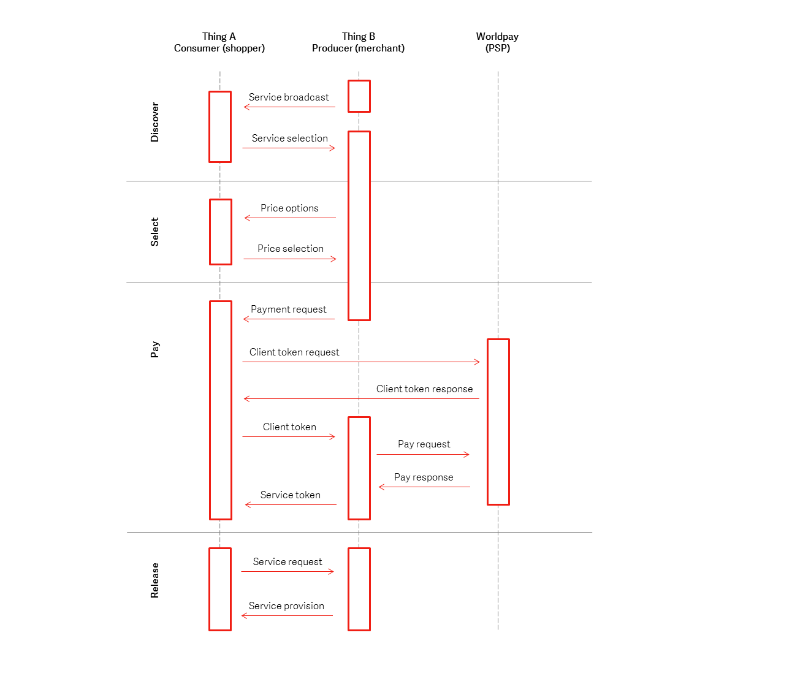

# .NET 

The .NET implementation for the Worldpay Within IoT payment SDK. This SDK, or Software Development Kit, enables smart devices to discover each other, negogiate a price for services, make a payment (through the Worldpay Online Payment gateway) for services, and then consume services via a **trusted trigger**. For more information, see [Home](index).

## Prerequisites

* Before you get started, you should have the .NET 4.5 framework and Visual Studio 2017 (any edition) installed on your system. We've tested this wrapper with Visual 2017 Community Edition.
* You should create an account with Worldpay Online so that you're able to generate your own test API key. You'll replace the Worldpay test keys with your own in the SDK. 

!!! warning

    Make sure you only use test API keys.

## Get Started

The .NET Worldpay Within SDK provides a convenient entry point for application developers who wish to create applications using the Worldpay Within SDK.

Currently, there are no [NuGet](https://nuget.org) published libraries for the SDK. This issue is being tracked in [Issue #1 on GitHub](https://github.com/WPTechInnovation/wpw-sdk-dotnet/issues/1).

For now, you will need to build the project yourself, by following these steps:

1. Clone or download the repository, e.g. `git clone git@github.com:WPTechInnovation/wpw-sdk-dotnet.git`. See the [project homepage](https://github.com/WPTechInnovation/wpw-sdk-dotnet) on GitHub for more options.
1. Open up the solution file in Visual Studio 2017 (community edition or better).
1. Build the solution.  Note that you must be connected to the Internet for nuget dependencies to be downloaded:
    * ApacheThrift 0.10.0
    * Common.Logging 3.3.1
    * Common.Logging.Core 3.3.1
1. Download the RPC Agent binary build for your platform. The RPC Agents can be downloaded from [the wpw-sdk-iot-core](https://github.com/WPTechInnovation/wpw-sdk-iot-core/tree/master/bin) project.
    * To configure the .NET SDK to find the agent, download the agent in to a directory named bin and set a `WPW_HOME` environment variable to point to the directory above it. For example, if `rpc-agent-windows-386.exe ` is installed in `C:\users\Andy\wpw\bin`, then set `WPW_HOME` to `C:\users\Andy\wpw`.

## Run the examples

Once you've loaded the projects in to Visual Studio and built the project successfully (please note you can [report any problems or errors to us](https://github.com/WPTechInnovation/wpw-sdk-dotnet/issues) on Github).

To run a sample app, run the `Worldpay.Within.Sample` project.

We'd recommend using your own test API keys for this. We've left our ones in the code, so that it "just works", but you won't be able to see the payments with our keys unless you change them. To do this, open `SimpleProducer.cs` and search for `MerchantServiceKey` in the `PSPConfig` declaration you can replace the existing MerchantServiceKey with your own value. 

The sample application is a Windows console application. To make a simple payment, do the following:

1. Select option 1 **Start Simple Producer**. This will start a local RPC Agent and register a separate producer with it. Ths producer has a very simple service declaration.
1. Select option 3 **Consume Purchase**. This will start another RPC Agent and attempt to consume the first product of the first service it finds on the network. (This will most likely be your producer.)

The sample application produces lots of logging, you can control this by editing the `App.config` file in the root of the sample project directory.

## See the payments

Once the devices have successfully communicated with each other to make a payment, you'll want to check to make sure that your devices are successfully making and receiving payments.

If you used your own test API keys:
1. Login to [Worldpay Online](https://online.worldpay.com).
1. You'll see your dashboard. Scroll down and you should see the payment within your **Recent Orders**.

If you've used Worldpay's own test API keys
1. Login to [Worldpay Online](https://online.worldpay.com).
1. Got to **Settings > API keys** and get your test keys.
1. Replace the keys in `SimpleProducer.cs`.

Re-run the sample application and you should see the payments coming through on the Worldpay Online payments dashboard.

## So what's happening?


<figcaption>The Worldpay Within Flows sequence diagram</figcaption>

You can see there are four phases; **Discover**, **Select**, **Pay**, and **Release**. For more information, see [Worldpay Within](http://www.worldpaywithin.com).

## Introduction to the different .NET projects

### Worldpay.Within

This is the main .NET wrapper entry point assembly. The public API is contained within here, inside the `Worldpay.Within` package.

You can use Sandcastle to build the docs, however they will be published online at some point (see [Issue 2](https://github.com/WPTechInnovation/wpw-sdk-dotnet/issues/2)).

### Worldpay.Within.Rpc

This project contains nothing but the generated RPC wrappers for Thrift; you never edit code in here. This is a separate project because the style and organisation of the code generated by the Thrift compiler is pretty poor; this approach isolates this to a single project.

You can rebuild this code first deleting all the existing source files and their directories, to clear out any existing code that may have been moved or removed in a new version, then running the Thrift compiler:

```thrift-0.10.0.exe -r -out %GOPATH%\src\innovation.worldpay.com\worldpay-within-sdk\wrappers\dotnet\Worldpay.Within\Worldpay.Within.Rpc --gen csharp:nullable,union %GOPATH%\src\innovation.worldpay.com\worldpay-within-sdk\rpc\wpwithin.thrift```

> The `-r` is there just for safety, in case subdirectories are used in future for storing dependent Thrift IDL files.

Note that the above oaths assume that you have downloaded the [Worldpay Within main SDK project](https://github.com/WPTechInnovation/worldpay-within-sdk) in to a regular "Go" development struture. However, only the thrift interface files are actually required. You can grab those directly from here: https://github.com/WPTechInnovation/worldpay-within-sdk/tree/master/rpc. There are two files needed: `wptypes.thrift` and `wpwithin.thrift`, both files must be in the same directory.  They are not included within the .NET repository because they are centrally maintained and used to generate multiple language wrappers.

Be sure to refresh the project source tree in Visual Studio to ensure that any newly generated files are included in the project. If you fail to do this, expect compile errors for missing types to be thrown.

## Using in your own applications

To use Worldpay Within, add the following DLLs to your project path:

1. `Worldpay.Within.dll` - this contains the SDK code and public entry points.
1. `Worldpay.Within.Rpc.dll` - the Thrift compiler-generated code to bridge to the core Go SDK.
1. `Thrift.dll` - Apache Thrift library. 
1. `Logging Framework` - whatever logging framework we're going to use.

To run a Worldpay Within application, the Thrift RPC code will need to be able to talk to an RPC Agent. The RPC Agent is a standalone application that manages the communication with remote third parties (for example, if you are creating a Consumer then the SDK code communicates with a local RPC Agent using the Thrift protocol, which then talks via HTTP to a remote RPC Agent, which then talks to a local Producer via the Thrift protocol).
