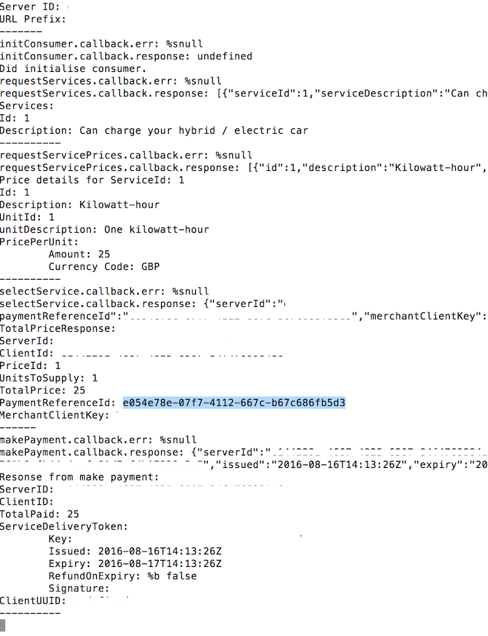

## Getting started with Go

To code against the raw Go SDK, you'll need to install Go and the Golang SDK. Alternatively, you can code against one of the multiple language wrappers, which give access to the SDK. 

The Golang SDK communicates with these other languages using RPC calls (in both directions), and the wrappers in the background interface using Thrift. This is not exposed to you as a developer; you work with the Interface layer in your language of choice. We've got SDKs in the following languages:
<div class="download">
  <a class="md-button" href="../nodejs">Node.js</a>
  <a class="md-button" href="../python27">Python</a>
  <a class="md-button" href="../java">Java</a>
  <a class="md-button" href="../dotnet">.NET</a>
</div>

## The binaries (if you don't want to build from source)

Please see the [Releases](https://github.com/WPTechInnovation/worldpay-within-sdk/releases) section of GitHub for access to pre-built binaries of the RPC Agent and Dev Client apps. Both of the apps have been built for 32bit and 64bit architectures on Windows, MacOS, Linux and Linux (ARM).

While the RPC Agent can be run from anywhere, it makes sense to add it to the directory of the application which will call it. The reason for this is that each application needs it own running instance of the RPC Agent and it can easily get confusing when there are multiple applications and agents deployed.

Please see the examples in both the [Java](java) and [Node.JS](nodejs) wrappers. These examples currently hold binaries for MacOS x64\. We suggest replacing that binary with an alternate build, if required.

The dev client can be run from anywhere as it is not coupled with anything else.

### Usage

*   RPC Agent `./rpc-agent -configfile <filename></filename>`. Please see explanation of rpc-agent config file for further info.
*   Dev Client `./dev-client`

## Install - if you want to go from the Go source files

1.  Install the Go command line
2.  Set up the environmental variables correctly; you only need to set `$GOPATH`, and that should be set as `//` where you want the code, for example: `/src/innovation.worldpay.com`
3.  Clone the repo to `$GOPATH/src/innovation.worldpay.com`
4.  Get the dependencies: `go get github.com/Sirupsen/logrus`
5.  Get the dependencies: `go get github.com/gorilla/mux`
6.  Get the dependencies: `go get github.com/nu7hatch/gouuid`
7.  Get the dependencies: `go get git.apache.org/thrift.git/lib/go/thrift`

## Configuration file versus command line flags

The RPC client takes command line flags, for example `-port 9091`. It can also take the flag `-configfile 'conf.json'`, so you can specify the configuration in a config file. For example:

``` json
{
	"WorldpayWithinConfig": {
		"BufferSize" : 100,
		"Buffered": false,
		"Framed": false,
		"Host": "127.0.0.1",
		"Logfile": "worldpayWithin.log",
		"Loglevel": "warn",
		"Port": 9081,
		"Protocol": "binary",
 		"Secure": false
	}
}
```

### How to run two example apps on one machine


<figcaption>The output of the log files for the orchestration of the flow.</figcaption>


<figcaption>Showing the payment in online.worldpay.com.</figcaption>

In the example, we're using two different ports:

*   Java - 9090 - Producer
*   Node.js - 9091 - Consumer

Follow these steps to run two apps on one machine:

1.  Open two terminal windows.
2.  Configure the rpc agent in each terminal window to run on each of the ports. 
  * In the producer window, run the RPC on port **9090**.
  * In the consumer window, run the RPC on port **9091**.
3.  Configure the Java app to run as the producer on **9090**.
4.  Configure the Node.js app to run as the consumer on **9091**, by changing the `createClient` in the example code.
5.  Run the Java producer app so we're broadcasting. The RPC agent broadcasting will continue to run in the background while the Java program has exited.
6.  Run the Node.js consumer app immediately.
7.  The **Discover**, **Select**, **Pay** and **Release** flows will all be triggered, as you can see above.