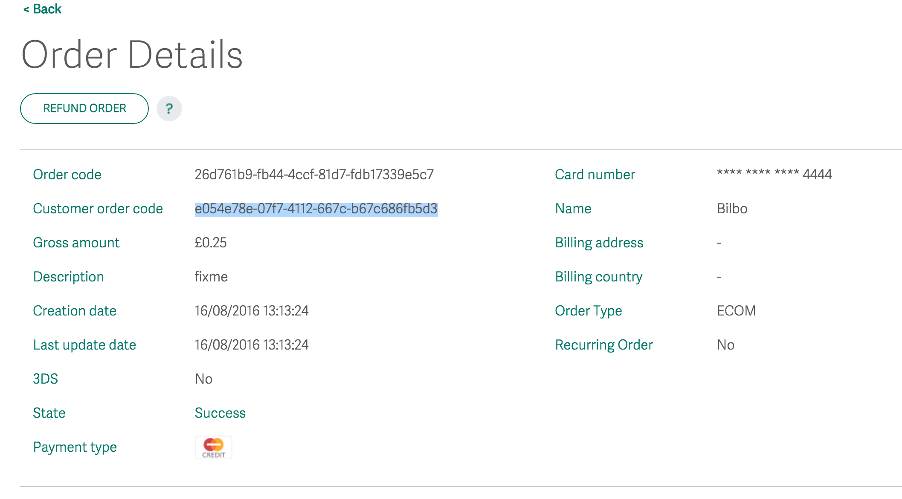

## Getting started with Go

To code against the raw Go SDK, you'll need to install Go and the Golang SDK. Alternatively, you can code against one of the multiple language wrappers, which give access to the SDK. 

The Golang SDK communicates with these other languages using RPC calls (in both directions), and the wrappers in the background interface using Thrift. This is not exposed to you as a developer; you work with the Interface layer in your language of choice. We've got SDKs in the following languages:

  <a class="md-button" href="../nodejs">Node.js</a>
  <a class="md-button" href="../python27">Python</a>
  <a class="md-button" href="../java">Java</a>
  <a class="md-button" href="../dotnet">.NET</a>

## Working with Go source files
### Prerequisites
1. Install the newest [Go command line](https://golang.org/doc/install#install).
2. If you do not have it, install [git](https://git-scm.com).

## Get started
1. Create a $GOPATH environment variable: (for example, on unix do: `export GOPATH=/home/pi/go`).
2. Get Apache Thrift and use the 0.10.0 branch:
  *		`go get git.apache.org/thrift.git/lib/go/thrift/...`
  * 	`cd $GOPATH/src/git.apache.org/thrift.git`
  *		`git checkout 0.10.0`
3. 	Get the SDK: `go get github.com/WPTechInnovaion/wpw-sdk-go/...`. Make sure you ignore the rpio.go system-specific warnings.

## Running the examples
Now you've got everything set up, you're able to build the examples inside: `$GOPATH/src/github.com/WPTechInnovation/wpw-sdk-go/example`.
Each example consists of a sample producer and a sample consumer:

*	$GOPATH/src/github.com/WPTechInnovation/wpw-sdk-go/examples/sample-consumer
*	$GOPATH/src/github.com/WPTechInnovation/wpw-sdk-go/examples/sample-producer-callbacks

To test the communication, build and run the producer:

1. 	`cd $GOPATH/src/github.com/WPTechInnovation/wpw-sdk-go/examples/sample-producer-callbacks`
2.	`go build`
3.	`./sample-producer-callbacks`

In a separate terminal window, build and run the consumer:

1.	`cd $GOPATH/src/github.com/WPTechInnovation/wpw-sdk-go/examples/sample-consumer`
2.	`go build`
3. 	`./sample-consumer`

<figcaption>The output of the log files for the orchestration of the flow.</figcaption>

<figcaption>Showing the payment in online.worldpay.com.</figcaption>

## Debugging

If you're having trouble, you can contact us at [Innovation@Worldpay.com](mailto:innovation@worldpay.com). Alternatively, you can [raise an issue in GitHub](https://github.com/WPTechInnovation/worldpay-within-sdk/issues).