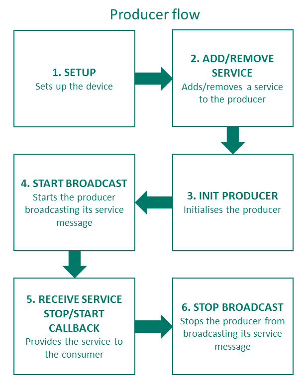

## 1\. Understand the flows

Before you start it's worth familiarising yourself with how Worldpay Within works. We recommend following the pre-established flows in the order they are presented for each Thing (Consumer thing and producer thing). If you stray from the flows, we cannot guarantee that the SDKs will work.

The devices are not synchronised by the SDK, so you'll need to ensure that the SDKs call the Worldpay Within API in the correct order. If you follow the steps below, then the outcome should be as expected.

### Worldpay Within flow

#### The Consumer (Shopper) flow
The consumer device should follow this flow. These steps should map to the interface either in Go, or in your chosen SDK wrapper.

<figcaption>The consumer flow.</figcaption>

#### The Producer (Merchant) flow
The producer device should follow this flow. These steps should map to the interface either in Go, or in your chosen SDK wrapper.

<figcaption>The producer flow.</figcaption>

## 2\. Choose your SDK

For the alpha release, we decided to go with five languages. The documentation and API specification can be found here:

  <a class="md-button" href="../nodejs">Node.js</a>
  <a class="md-button" href="../python27">Python</a>
  <a class="md-button" href="../java">Java</a>
  <a class="md-button" href="../dotnet">.NET</a>
  <a class="md-button" href="../getting-started-with-go">Go</a>

