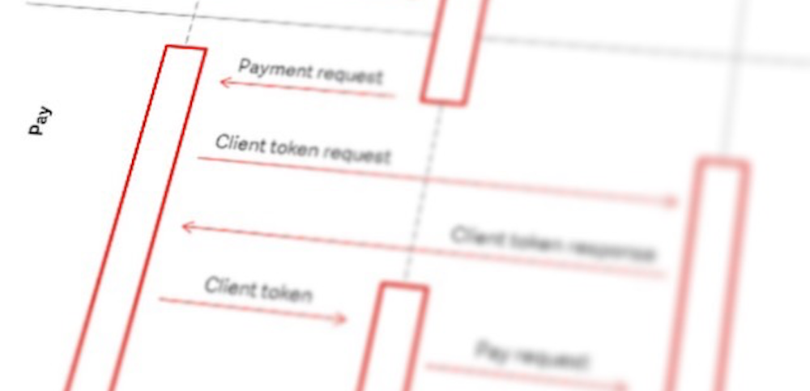
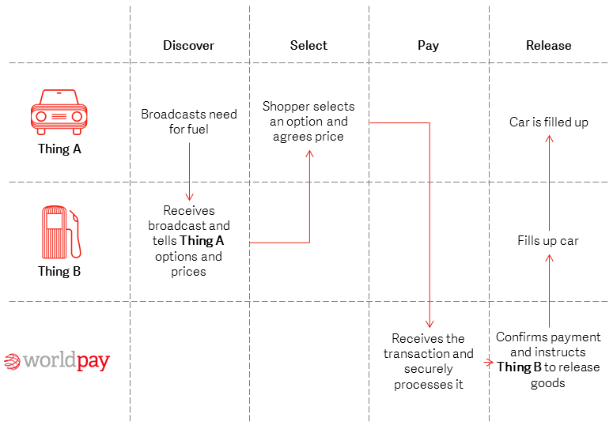

# Welcome to Worldpay Within

  

    
  

  

    <h2>What it is</h2>
    
Worldpay Within is an embeddable payments agent that can be 'plugged' into an app or smart device. It lets you discover other devices and pay for that device's service(s). We've got the SDK in five languages: <a href="python27">Python</a>, <a href="dotnet">.NET</a>, <a href="nodejs">Node.js</a>, <a href="python27">Java</a> and <a href="getting-started-with-go">Go</a>.

    <a class="md-button" href="#demo">Watch the demo</a>
  

  

     
  

  

    <h2>Why use it</h2>
    
You can make or take payments from an IoT device. Maybe your car is running out of fuel and it broadcasts a need for petrol; perhaps you're a petrol station that has a service to offer.

    <a class="md-button" href="#why-use-it">Find out more</a>

  

  

    
  

  

    <h2>How it works</h2>
    
There are four simple interactions that take place with Worldpay Within: <strong>Discover</strong>, <strong>Select</strong>, <strong>Pay</strong> and <strong>Release</strong>.

    <a class="md-button" href="#how-it-works">Find out more</a>
  

  

    <h2 id="demo">A demonstration</h2>
    
  

  

  

    <iframe width="560" height="315" src="https://www.youtube.com/embed/94fm-DYtLb8" frameborder="0" allowfullscreen></iframe>
  

## What it is

Driven by the [Internet of Things](#iot) (IoT), Worldpay is keen to demonstrate how you can integrate payments into everyday objects. So we created Worldpay Within.

We’ve got a series of [open source](#open-source) software development kits (SDKs) that let you make and accept payments from a range of devices. We’ve got SDKs for [Node.js](nodejs), [Python](python27), [Java](java), [.NET](dotnet) and [Go](getting-started-with-go). You can download these SDKs, get playing, configure your setup, and recommend changes to our open source libraries.

##  Why use it

You might want to use Worldpay Within if you’re a startup company that’s creating technologies relating to the Internet of Things. Or perhaps you’re a hobby developer who likes creating innovative technologies in your spare time.

Worldpay Within provides you with the functionality and the SDKs to explore how the Internet of Things allows you to test the interaction between two devices and see how devices can make and receive payments.

##  How it works

There are four simple interactions that take place with Worldpay Within: **Discover**, **Select**, **Pay** and **Release**.

Imagine that a car needs some fuel. It stops by a petrol station and broadcasts that it needs fuel. The petrol station receives this signal, informs the car of how much fuel costs and what options are available, and once the shopper has made a choice, Worldpay will process the payment and inform the petrol station that it can fuel the car.

<figcaption>A demonstration of how to use Worldpay Within in four easy interactions</figcaption>

1.  **Discover** - **Thing A (shopper)** broadcasts to **Thing B (merchant)** that it requires something.
2.  **Select** - When **Thing B** receives **Thing A’s** broadcast, it presents the options and the shopper chooses one.
3.  **Pay** - **Thing A** pays.
4.  **Release** - Worldpay sends **Thing B** a secure token (a trusted trigger) to release the service to **Thing A.**

##  The Internet of Things

The Internet of Things (IoT) is an initiative to connect everyday items to the internet. It could be a car which needs to pay for fuel or repairs, or a fridge which needs to order some groceries.

[It's been estimated](http://www.gartner.com/newsroom/id/3165317) that there will be 6 billion devices connected to the IoT by the end of 2016 and 20 billion by 2020\. Some of these devices will consume services from other devices for which a payment will be required.

By using a set of APIs, “Thing” developers will be able to integrate Worldpay Within into their IoT device, enabling the “Thing” to make and/or receive payments for services to and from other “Things”.

Worldpay Within orchestrates smart things talking to each other and paying for services.

## Hackathons

In 2016, Worldpay hosted the [Payments & IOT Hackathon](http://worldpay-hackathon.bemyapp.com) in which we wanted to take digital payments to the next level. In 2017, we're hosting another Hackathon in Romania, in which we release Worldpay Within.

Want to find out more? Head over to the [Hackathons](hackathons) page.

##  It's open source

Worldpay Within is open source, so why not give it a go yourself? You can find the GitHub library [here](https://github.com/WPTechInnovation/worldpay-within-sdk).

It's still an alpha-based experiment, but we're actively building new features (and bug fixes) and are concurrently working on evolving the security architecture so we can take real payments.

We'd love to see what you can come up with, so why not become a contributor? Head over to the [Issues page](https://github.com/WPTechInnovation/worldpay-within-sdk/issues) to see how you can help. 

## Get the SDKs

Worldpay Within's SDK is written in GoLang and runs on smart devices, including Raspberry Pi. It lets you make and receive payments within the IoT. You can download the SDK in any of these languages and begin testing:

  <a class="md-button" href="nodejs">Node.js</a>
  <a class="md-button" href="python27">Python</a>
  <a class="md-button" href="java">Java</a>
  <a class="md-button" href="dotnet">.NET</a>
  <a class="md-button" href="getting-started-with-go">Go</a>

## Contact us

If you've got any questions, or if you want to find out more, why not give us a shout at [Innovation@Worldpay.com](mailto:innovation@worldpay.com).
You can also contribute to our [GitHub repository](https://github.com/WPTechInnovation/worldpay-within-sdk) by [looking at our issues](https://github.com/WPTechInnovation/worldpay-within-sdk/issues) or becoming a contributor.