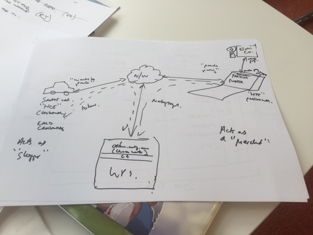
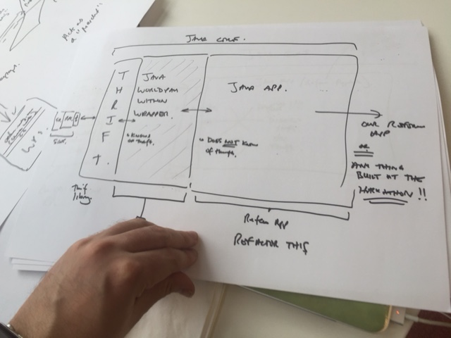
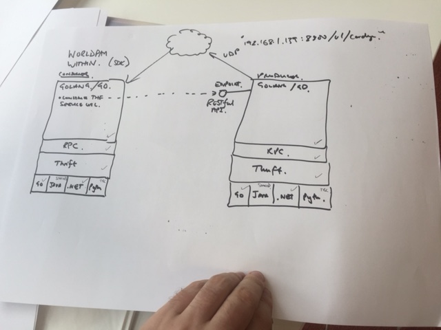

## Internal Structure of Worldpay Within

### What is Worldpay Within and what does Worldpay within do

Worldpay is an embeddable payments agent, for the Internet of Things (IoT) that can be 'plugged' into your app for a smart device, enabling it to discover services of other devices, pay for those services, and then consume those services. Conversely it also allows your smart device to expose services to consumers, receive payments for those services, and then release services to a consumer using the idea of a 'Trusted Trigger'.

It is all about enabling payments in IoT, and allowing smart devices to communicate with each other and exchange value for services in IoT

So a consumer is a smart device which is looking for services, pays for services and consumes services

On the other hand a producer is a smart device that is able to advertise availability of it's owner services to consumers, then negotiate a payment, take a payment, and release those services to the trusted consumer that made the payment

<figcaption>What Worldpay Within Does.</figcaption>

The use case shown in the example above has a smart car looking for parking, and paying a smart parking meter for parking in it's parking bay. The smart car "wants to park", so has HCE (Host Card Emulation; card credentials), it acts as a shopper. When trying to make a payment, it will go off to the Worldpay online payments gateway and request tokenised card credentials based on the smart device it is trying to consume services from.

This token is then securely passed to the parking meter. In this case the parking meter is the Producer, or is acting as the merchant, or HTE (Host Terminal Emulation, accepting payment), which then directly communicates with the online Worldpay gateway to make a 'card on file' or 'eCommerce' type payment authorisation request. With the payment authorised it then releases the purchased service to the consumer.

The beauty of Worldpay Within is that it enables smart devices to both make payments and receive payments. In this example above the parking meter could then go on to make payments to the electricity companies smart hub which is powering it.

### How the Wrapper works

<figcaption>How the Wrapper Works.</figcaption>

On the left-hand side you have the SDK, on the right-hand side you have the Wrapper, in this case the Java Core. The SDK in Golang has an RPC layer on top which is exposed via Thrift. The Java Core or Wrapper, is built up of the Thrift layer which does the RPC comms to the core SDK. Plus the wrapper acts as an adapter converting all the data / objects / errors into Pojos that the Java core, or the app you are building can work with.

The important thing to recognise here is that none of the Thrift layer is exposed to you as a developer, and all the RPC calls are handled for you, so essentially you are calling the Worldpay Within seamlessly, managed by the Worldpay Within Wrapper in the appropriate language you are working in

### How the wrapper and SDK work

<figcaption>How the wrapper and SDK work.</figcaption>

This is another view on the SDK and the app - this scenario there are two devices with Worldpay Within installed on them, and they communicate over the internet. You'll note that one is the 'consumer' and the other is the 'producer', as explained above. Now as you go down the layers, you have the RPC layer, then the Thrift layer and finally the wrapper layer, which is above to communicate with the SDK via RPC calls, what is not shown is your app will be the next layer shown on the diagram.

In this scenario, the producer is UDP broadcasting a service message, which includes what it's hostname, IP and UrlPrefix are. Once the consumer does device discovery, it is able to communicate over HTTP with the restful endpoint on the producer to find out what services it offers, and then begins the rest of the flow

### What's happening inside the SDK

Certainly for the first release, we have open sourced the wrappers and example apps, but kept the internals of the Golang SDK closed source, however with the appropriate success of the project, we shall consider open sourcing this component too.

It is useful, of course, to know exactly what is happening inside this black box, so the following details the architecture of Worldpay Within and what is happening in the internals

[The Worldpay Within Architecture](architecture.html)