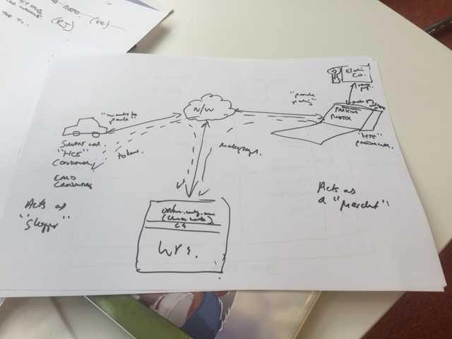
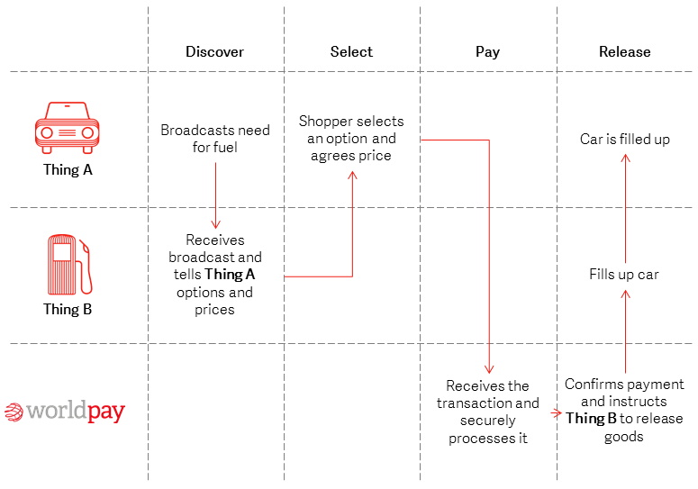

The aim of the Worldpay Within SDK is to allow payments within IoT.

Worldpay Within orchestrates smart things talking to each other and paying for services. It does this through 4 main services, this is between 'consumer' devices (requesting the service / consuming the service) and 'producer' devices (providing the service / producing the service):

1.  Discover - UDP broadcast from the 'producer' thing to the 'consumer' thing
2.  Negotiate - AT the moment the consumer contacts the producer using HTTPS RESTful web service, get's a menu of prices and selects a price. Wouldn't it be great if there was smart bidding?
3.  Make a payment - Online.worldpay.com or Worldpay Total (US or Securnet) are used to make a payment
4.  Release a service - Trusted trigger provides a secure token to the consumer that is used to request the service from the producer.

SDK source code is in the repo (make up of the 'wrapper' which is the API layer), you then need the IOT core component, which you download from releases. This is the RPC-agent - so the IoT core component can be thought of as the engine, or the Go SDK packaged up to work with whatever API (think of the wrapper as the API) in whichever language you prefer.

We talk about wrappers, this is the API code in the preferred language, or the rest of the rocket.

The core of this SDK is written in Go with a native Go interface. Along with the native Go interface is an RPC layer (Apache Thrift) to allow communication through other languages. It is intended that we will develop a number of complementary wrapper libraries for other languages which should include C#.NET, Java, Python at a minimum.

[Here's a quick introduction for the Atlanta Fintech Hackathon](atdc.html)

[Sign up to our slack group, for comms, support and staying connected](https://wpwithin-slack-in.herokuapp.com)

[Getting started guide](getting-started.html) [Get the SDK](getit.html) [The Worldpay Within Architecture](architecture.html)

### What is Worldpay Within and what does Worldpay within do

Worldpay is an embeddable payments agent, for the Internet of Things (IoT) that can be 'plugged' into your app for a smart device, enabling it to discover services of other devices, pay for those services, and then consume those services. Conversely it also allows your smart device to expose services to consumers, receive payments for those services, and then release services to a consumer using the idea of a 'Trusted Trigger'.

It is all about enabling payments in IoT, and allowing smart devices to communicate with each other and exchange value for services in IoT

So a consumer is a smart device which is looking for services, pays for services and consumes services

On the other hand a producer is a smart device that is able to advertise availability of it's owner services to consumers, then negogiate a payment, take a payment, and release those services to the trusted consumer that made the payment

<figcaption>What Worldpay Within Does.</figcaption>

The use case shown in the example above has a smart car looking for parking, and paying a smart parking meter for parking in it's parking bay. The smart car "wants to park", so has HCE (Host Card Emulation; card credentials), it acts as a shopper. When trying to make a payment, it will go off to the Worldpay online payments gateway and request tokenised card credentials based on the smart device it is trying to consume services from.

This token is then securely passed to the parking meter. In this case the parking meter is the Producer, or is acting as the merchant, or HTE (Host Terminal Emulation, accepting payment), which then directly communicates with the online Worldlpay gateway to make a 'card on file' or 'eCommerce' type payment authorisation request. With the payment authorised it then releases the purhcased service to the consumer.

The beauty of Worldpay Within is that it enables smart devices to both make payments and receive payments. In this example above the parking meter could then go on to make payments to the electricity companies smart hub which is powering it.

-->

### What it is

Driven by the [Internet of Things](#iot), Worldpay has been keen to demonstrate how you can integrate payments into everyday objects. So, we created Worldpay Within, an embeddable payments agent that can be 'plugged' into your app or a smart device. It then lets you discover other devices and pay for that device’s service.

We’ve got a series of [open source](#open-source) software development kits (SDKs) that lets you make and accept payments from a range of devices. We’ve got SDKs for [node.js](nodejs.html), [Go](getting-started-with-go.html), [.NET](dotnet.html), [Java](wrapper-doc/javadoc/index.html) and [Python 2.7 and 3](python27.html). You can download these SDKs, get playing, configure your setup, and recommend changes to our open source libraries.

### Why use it

You might want to use Worldpay Within if you’re a startup company that’s creating technologies relating to the Internet of Things. Or perhaps you’re a hobby developer who likes creating innovative technologies in your spare time.

### A demonstration

<iframe class="video" height="315" src="https://www.youtube.com/embed/94fm-DYtLb8?controls=1&fs=0&rel=0&showinfo=0" frameborder="0" allowfullscreen></iframe>

### The Internet of Things

The Internet of Things (IoT) is an initiative to connect everyday items to the internet. It could be a car which needs to pay for fuel or some repairs, a fridge which needs to order some groceries.

[It is estimated](http://www.gartner.com/newsroom/id/3165317) that there will be 6 billion devices connected to the IoT by the end of 2016 and 20 billion by 2020\. Some of these devices will consume services from other devices for which a payment will be required.

By using a set of APIs, “Thing” developers will be able to integrate Worldpay Within into their IoT device, enabling the “Thing” to make and/or receive payments for services to and from other “Things”.

Worldpay Within orchestrates smart things talking to each other and paying for services.

### How it works

There are four simple interactions that takes place with Worldpay Within: **Discover**, **Select**, **Pay** and **Release**.

Let's imagine that a car needs some fuel. It stops by a petrol station and broadcasts that it needs some fuel. The petrol station receives this signal, informs the car of how much fuel costs and what options are available, and once the shopper has agreed the price, then Worldpay will process the payment and inform the petrol station that it can fuel the car.

<figcaption>A demonstration of how to use Worldpay Within in four easy interactions</figcaption>

1.  Discover - **Thing A (shopper)** broadcasts to **Thing B (merchant)** that it requires something.
2.  Select - When **Thing B** receives **Thing A’s** broadcast, it tells them the options and the shopper chooses one.
3.  Pay - **Thing A** pays.
4.  Release - Worldpay sends **Thing B** a secure token (a trusted trigger) to release the service to **Thing A.**

### Hackathons

In 2016, Worldpay hosted the [Payments & IOT Hackathon](http://worldpay-hackathon.bemyapp.com) in which we wanted to take digital payments to the next level. In 2017, we're hosting another Hackathon in Romania, in which we release Worldpay Within.

Want to find out more? Head over to the [Hackathons](hackathons.html) page.

### It's open source

Worldpay Within is open source, so why not give it a go yourself? You can find the GitHub library [here.](https://github.com/WPTechInnovation/worldpay-within-sdk/issues)

It's still an alpha based experiment, but we're actively building new features (and bug fixes) and are concurrently working on evolving the security architecture so we can take real payments.

If you'd like to contribute to the project, head over to the [Issues page](https://github.com/WPTechInnovation/worldpay-within-sdk/issues) to see how you can help. And, of course, we'd love to see what you can come up with, so why not become a contributor?

### Get the SDKs

Worldpay Within's SDK is written in GoLang and runs on smart devices, including Raspberry Pi. It allows you to make and receive payments within the IoT. We've got wrappers in these languages:

  <a class="md-button" href="getting-started-with-go.html">Go</a>
  <a class="md-button" href="wrapper-doc/javadoc/index.html">Java</a>
  <a class="md-button" href="dotnet.html">.NET</a>
  <a class="md-button" href="python27.html">Python</a>
  <a class="md-button" href="nodejs.html">Node.js</a>

### Contact us

If you've got any questions, or if you want to find out more, why not give us a shout at [Innovation@Worldpay.com](mailto:innovation@worldpay.com).