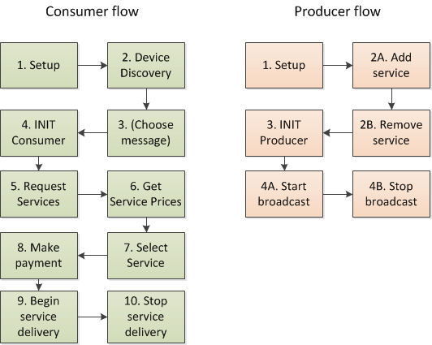

### 1\. Understand the recommended flows

Before you get started, it's worth familiarising yourself with how Worldpay Within works. We'd recommend following the pre-established flows in the order they are presented for each Thing (Machine A and Machine B). If you stray from the flows, we cannot guarantee that the SDKs will work.

We recommend following the below flows for consumer and producer devices. You can find a breakdown in each of the [steps below.](#steps)

The devices are not synchronised by the SDK, so you'll need to ensure that the SDKs call the Worldpay Within API in the correct order. If you follow the steps below, then the outcome should be as expected.

#### Worldpay Within flow

<figcaption>The flows of the producer and consumer.</figcaption>

##### The Consumer flow

The consumer device should follow this flow. These steps should map to the interface either in Go, or in your chosen SDK wrapper.

|**Step in Flow**|**What it does**|
| ------------- | ------------- |
|1\. SETUP|Setups up the device|
|2\. DEVICE DISCOVERY|Discover devices that are broadcasting messages|
|3\. (CHOOSE MESSAGE)|Choose the message, then use that information in the following steps|
|4\. INIT CONSUMER|Initialises the device as a consumer|
|5\. REQUEST SERVICES|Request service messages from the device that is broadcasting, which lists what services it's offering|
|6\. GET SERVICE PRICES|Get's the prices for the service you are interested in|
|7\. SELECT SERVICE|Selects the service the device wants to consume|
|8\. MAKE PAYMENT|Makes a payment for the service that is chosen|
|9\. BEGIN SERVICE DELIVERY|Starts the process / flow to consume the service based on the service token received.|
|10\. STOP SERVICE DELIVERY|Called to tell the other thing that it has completed it's consumption of the service|

##### The Producer flow

The producer device should follow this flow. These steps should map to the interface either in Go, or in your chosen SDK wrapper.

|**Step in Flow**|**What it does**|
| ------------- | ------------- |
|1\. SETUP|Setups the device|
|2A. ADD SERVICE|Adds a service to the producer|
|2B. REMOVE SERVICE|Removes a service from the producer|
|3\. INIT PRODUCER|Initialises the producer|
|4A. START BROADCAST|Starts the producer broadcasting it's service message|
|4B. STOP BROADCAST|Stops the producer from broadcasting it's service message|

### 2\. Choose your SDK

For the alpha release, we made the decision to go with four different wrappers. The documentation and API specification can be found here:

[Go to Java Javadoc [Go to Python 2.7 doc](python27.html) [Go to .net / C# doc](dotnet.html) [Go to Node.js doc](nodejs.html)
