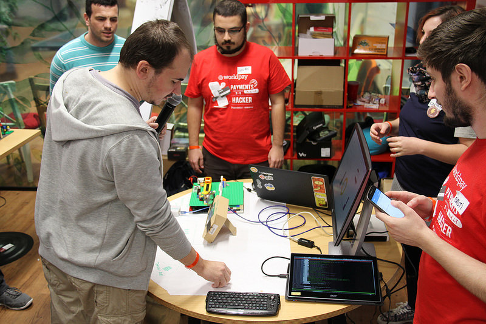
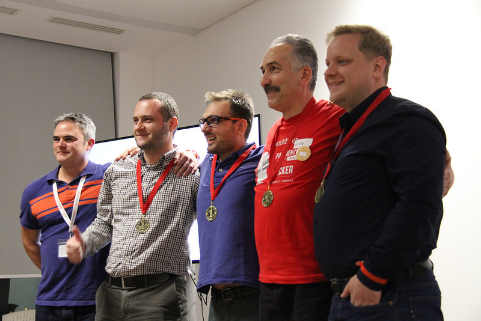
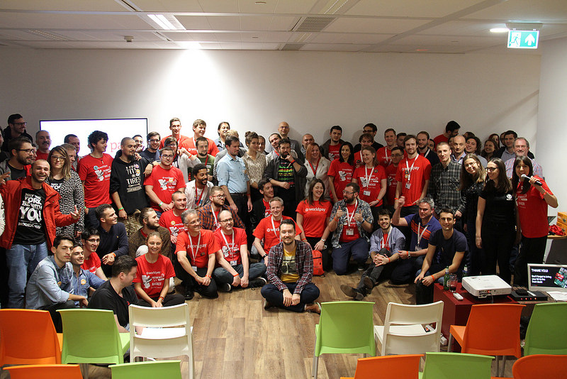

# Worldpay’s Bucharest Hackathon
## The event in Romania
On Friday 3 November 2017, developers, designers, makers, entrepreneurs, and  mentors (from Worldpay and the hackathon sponsors) descended on The Impact Hub, Bucharest, for Worldpay’s first ever hackathon in Romania. Based on the ideas of the Internet of Things, Worldpay’s own Worldpay Within SDK was put through its paces as teams of developers worked on building software that allowed smart devices to make payments to each other.

The event was a resounding success; the venue was alight with an exciting buzz of ideas as the teams started to visualise what they’re going to build and how they’re going to go about doing it. You can see photos from the event [here](https://www.flickr.com/photos/bemyapp/albums/72157662247969258/page1).

The contestants blew us away with just how innovative their ideas were. The ideas ranged from a Smart Cat feeding bowl - which could pay for food when the bowl was empty - and even Smart Car Parking, which pays for a parking space when you arrive in the spot. Some teams even utilised small little drones that could be used to make a payment at a shop!

<figcaption>A team working on their idea</figcaption>

From a Worldpay perspective, it was a very insightful experience. The Innovation Team had created the SDK from the ground up, and the developers hacking it really helped us to understand some of the limitations of the SDK, and where it could be improved. These are just a few of our findings:

* 	The Python, Node.js and Java SDKs were the most popular
* 	There was a significant demand for an Android version of the SDK
* 	Developers would like us to build more examples of the SDK
* 	There was interest for us to create a webinar for how to use each SDK

## So, who won?
There were three judges: one from Worldpay, one from Endava, and one from Consult Hyperion. Speaking to them after the judging was complete, it was clear to see that they loved all of the ideas. But, of the 13 groups, there could only be one winner.

The team that built the Smart Utilities platform won the 9000 RON prize. They created a platform which allows the selection of the cheapest time to use electricity in a home. So, if you want to do your laundry on a Sunday, you’d select this based on an app that the team created and the SDK communicates with the electricity providers to find the cheapest time of the day to run the wash. This not only saves you money, but it saves the environment too! Well done, guys!

<figcaption>The hackathon winners</figcaption>

## What happens now?
Well, just because our first ever Romanian hackathon event is over, it doesn’t mean that the development ends here. We’re got a list of over 30 things that we’ve taken away from the event. We’re going to go back to Worldpay HQ with a wealth of ideas to build on the many successes and failures (there were only a couple, promise!), to make sure that the Worldpay Within SDK is the driving force of Worldpay’s involvement in the Internet of Things.

## A final thanks
We couldn’t have done it without our sponsors Endava and Consult Hyperion (and their mentors). And the event wouldn’t have even taken place without the unending support of BeMyApp, who helped organise the event and provided platforms and infrastructure for the event. We'd also like to thank the  mentors and the organisation team from Worldpay, who provided support throughout the event.

We’d love to thank each and every contestant who attended the hackathon. It’s inspiring to see such passion, such interest for the Internet of Things, and it was inspirational to see just what could be created using our SDK.

<figcaption>Group photo of us at the hackathon</figcaption>
